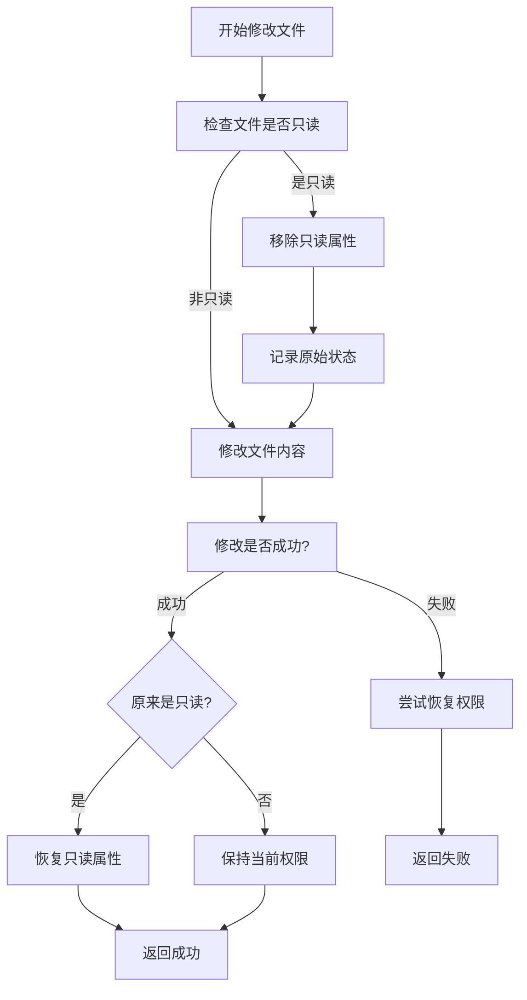

# 文件权限处理增强功能

## 功能概述

在用户的建议下，为storage.json文件修改功能添加了完整的文件权限处理机制，确保能够正确处理只读文件的修改和权限恢复。

## 问题背景

Cursor可能会将`storage.json`文件设置为只读属性来保护重要配置，直接修改此类文件会失败。需要在修改前移除只读属性，修改完成后恢复原始权限。

## 解决方案

### 1. 创建文件权限处理工具模块 (`file-permission-utils.js`)

#### 核心功能
- ✅ `isFileReadOnly()` - 检查文件是否为只读
- ✅ `removeReadOnlyAttribute()` - 移除只读属性
- ✅ `restoreReadOnlyAttribute()` - 恢复只读属性
- ✅ `safeModifyFile()` - 安全修改文件（自动处理权限）

#### 跨平台支持
- **Windows**: 使用`attrib`命令处理文件属性
  ```bash
  attrib +R file.txt  # 设置只读
  attrib -R file.txt  # 移除只读
  attrib file.txt     # 查看属性
  ```
- **Unix/Linux**: 使用文件权限位处理
  ```javascript
  fs.chmodSync(file, mode | 0o200)  // 添加写权限
  fs.chmodSync(file, mode & ~0o200) // 移除写权限
  ```

### 2. 集成到storage.json重置流程

#### 修改前的代码
```javascript
// 读取并更新配置文件
const originalContent = fs.readFileSync(storageFilePath, 'utf8');
const config = JSON.parse(originalContent);
// 更新字段...
fs.writeFileSync(storageFilePath, updatedJson, 'utf8');
```

#### 修改后的代码
```javascript
// 使用安全的文件修改方法（自动处理只读属性）
const modifySuccess = await safeModifyFile(storageFilePath, async () => {
  // 读取并更新配置文件
  const originalContent = fs.readFileSync(storageFilePath, 'utf8');
  const config = JSON.parse(originalContent);
  // 更新字段...
  fs.writeFileSync(storageFilePath, updatedJson, 'utf8');
});

if (!modifySuccess) {
  throw new Error('文件修改失败：可能由于权限问题无法写入storage.json');
}
```

### 3. 权限处理流程



### 4. 日志输出示例

#### 成功场景
```
重置机器码 - 目标文件: C:\Users\用户名\AppData\Roaming\Cursor\User\globalStorage\storage.json
配置文件已备份到: ...backups\storage.json.backup_2024-01-01T12-00-00-000Z
生成新的机器码（按照用户要求的格式）:
- telemetry.machineId: a1b2c3d4... (64位字符)
- telemetry.devDeviceId: 12345678-1234-1234-1234-123456789012 (随机UUID)
- telemetry.sqmId: {87654321-4321-4321-4321-210987654321} (拼接{UUID转大写})
- telemetry.macMachineId: abcdefgh-ijkl-mnop-qrst-uvwxyz123456
正在移除文件只读属性: storage.json
只读属性移除成功
正在恢复文件只读属性: storage.json
只读属性恢复成功
storage.json机器码重置成功
```

#### 权限问题场景
```
检查文件只读属性失败: 访问被拒绝
安全修改文件失败: 无法移除文件只读属性
文件修改失败：可能由于权限问题无法写入storage.json
```

### 5. 测试验证

#### 自动化测试
创建了完整的测试脚本来验证权限处理功能：

1. ✅ 创建测试文件
2. ✅ 设置文件为只读
3. ✅ 验证只读状态检测
4. ✅ 使用safeModifyFile修改文件
5. ✅ 验证文件内容更改
6. ✅ 验证权限正确恢复
7. ✅ 清理测试文件

#### 测试结果
```
🧪 开始测试文件权限处理功能...
✅ 测试文件创建成功
✅ 文件只读状态: true
✅ 文件修改成功
✅ 权限处理测试通过！文件权限已正确恢复
🧹 测试文件已清理
🎉 文件权限处理测试完成！
```

## 安全特性

### 1. 权限恢复保证
- 即使修改失败，也会尝试恢复原始权限
- 避免文件权限状态不一致

### 2. 错误处理
- 完善的异常捕获和日志记录
- 权限操作失败不会中断主流程

### 3. 跨平台兼容
- Windows和Unix/Linux系统都有专门的处理逻辑
- 使用各平台原生的权限管理方式

## 使用场景

### 主要应用
- ✅ **storage.json机器码重置**（主要功能）
- ✅ **任何需要修改只读配置文件的场景**

### 扩展应用
- 可以用于修改其他Cursor配置文件
- 可以用于需要权限处理的任何文件操作

## 总结

现在的文件修改流程更加健壮和安全：

1. **自动权限检测** - 无需手动判断文件是否只读
2. **透明权限处理** - 自动移除和恢复只读属性
3. **完整错误处理** - 保证操作的原子性
4. **跨平台兼容** - 支持Windows、macOS、Linux

这确保了storage.json机器码重置功能能够在各种权限环境下正常工作，提高了续杯功能的可靠性。 